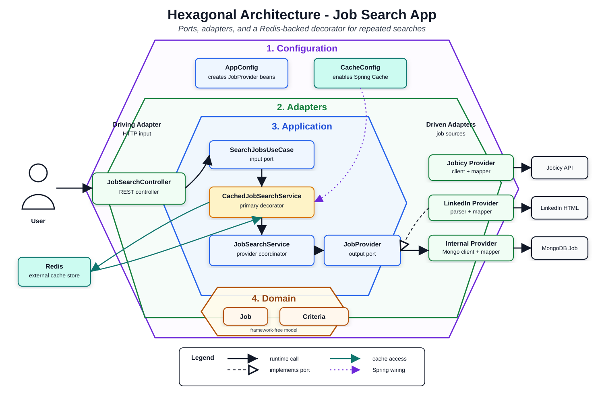
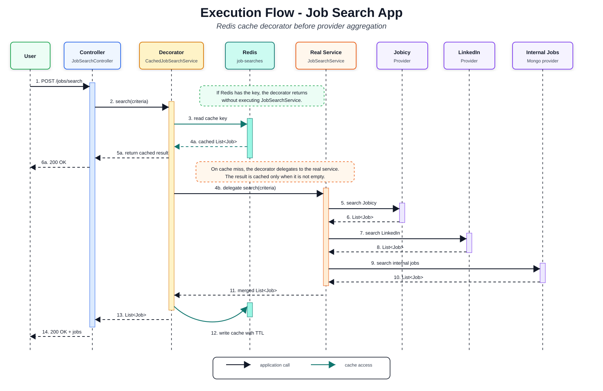
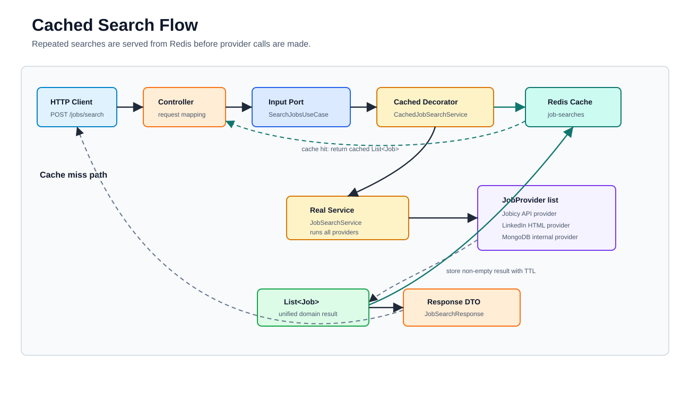
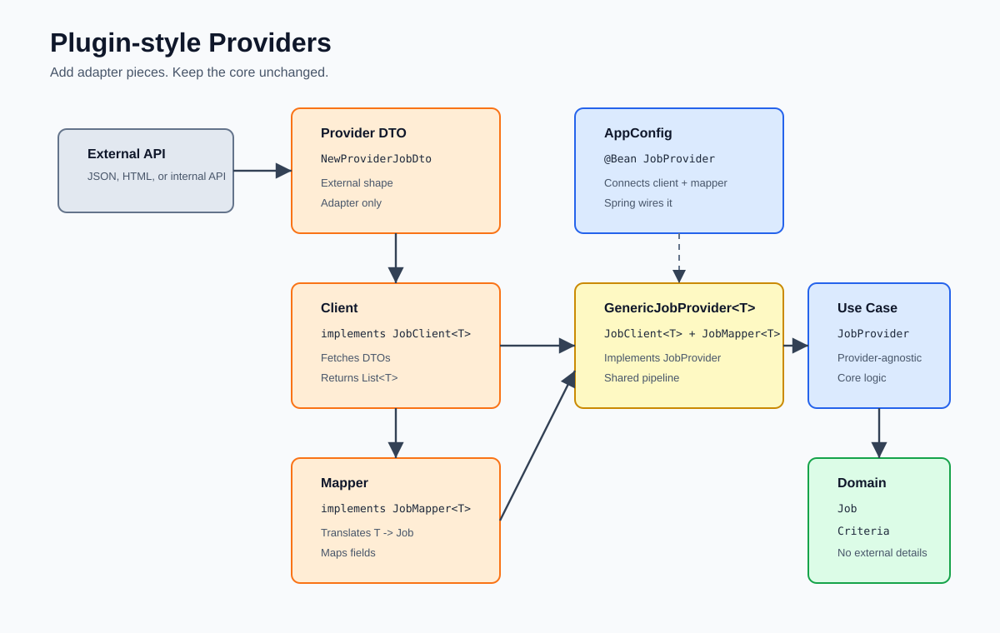

# Job Search App - Clean Architecture

Spring Boot application that searches jobs from multiple providers and exposes them through one clean domain model.

The project is built around **Clean Architecture**, **Hexagonal Architecture**, **SOLID**, and a small **Decorator** around the job search use case for Redis-backed caching. External APIs, databases, and cache storage stay at the edges. The application core works with ports, use cases, and domain records.



## What It Does

- Receives a job search request through HTTP.
- Converts that request into `JobSearchCriteria`.
- Checks Redis-backed cache for an existing search result.
- On cache miss, queries every configured `JobProvider`.
- Maps provider-specific data into the domain `Job`.
- Stores non-empty search results in cache.
- Returns one unified response.

Current providers:

- Jobicy external API
- LinkedIn public job listings
- Internal jobs from MongoDB

## Stack

| Area | Tool | Used for |
| --- | --- | --- |
| Language | Java 21 | Application code and domain model |
| Framework | Spring Boot 4.1.0 | Application startup, configuration, and dependency injection |
| Web | Spring Web MVC | REST controller and JSON HTTP API |
| HTTP client | Spring `RestClient` | Calls to external job providers |
| Data access | Spring Data MongoDB | Reads internal job documents from MongoDB |
| Database | MongoDB Atlas / MongoDB 7 | Stores internal jobs |
| Cache abstraction | Spring Cache | Declarative method caching with `@Cacheable` |
| Cache store | Redis 7 | Stores repeated job search results |
| Cache UI | RedisInsight | Local inspection of Redis keys and TTLs |
| API docs | springdoc-openapi / Swagger UI | OpenAPI contract and endpoint testing |
| Build | Maven | Dependency management, build, and test lifecycle |
| HTML parsing | jsoup | Parsing LinkedIn job listing HTML |
| Tests | JUnit 5 / Mockito / AssertJ / Spring Boot Test | Unit tests, mocks, assertions, and Spring context test |

## Run

Default application URL:

```text
http://localhost:8080
```

Local infrastructure can be started with Docker Compose:

```bash
docker compose up -d
```

Local services:

| Service | Local URL |
| --- | --- |
| MongoDB | `mongodb://localhost:27017/job-search-app` |
| Redis | `redis://localhost:6379` |
| RedisInsight | `http://localhost:5540` |

When RedisInsight runs from Docker Compose, connect it to Redis with host `redis` and port `6379`.

The application uses MongoDB from `MONGODB_URI` when that environment variable is present.
If it is not present, it falls back to local MongoDB:

```text
mongodb://localhost:27017/job-search-app
```

The application uses Redis from `REDIS_URL` when that environment variable is present.
If it is not present, it falls back to local Redis:

```text
redis://localhost:6379
```

## API

OpenAPI documentation:

```text
http://localhost:8080/swagger-ui.html
http://localhost:8080/v3/api-docs
```

### Search Jobs

```http
POST /jobs/search
Content-Type: application/json
```

Request:

```json
{
  "text": "java",
  "location": "argentina",
  "remote": true
}
```

Response:

```json
[
  {
    "externalId": "12345",
    "source": "jobicy",
    "title": "Java Backend Developer",
    "company": "Example Company",
    "location": "Argentina",
    "creationDate": "2026-07-13T00:00:00Z"
  }
]
```

## Architecture



Dependency direction:

```text
adapter/in/web
    -> application/port/in
        -> application/service/CachedJobSearchService
            -> application/service/JobSearchService
                -> application/port/out
                    -> adapter/out/*

cache storage stays behind Spring Cache + Redis
domain stays independent
```

The rule:

> The core does not depend on external APIs, frameworks, HTML, JSON payloads, provider DTOs, MongoDB documents, or Redis storage details.

That means:

- `domain` does not know Spring.
- `domain` does not know Jobicy.
- `domain` does not know LinkedIn.
- `JobSearchService` depends on `JobProvider`, not on HTTP clients.
- `CachedJobSearchService` decorates the use case with cache behavior.
- Each provider can change without leaking details into the use case.

## Application Service

The real use case implementation coordinates providers.

[`JobSearchService.java`](src/main/java/com/hmeclazcke/jobsearchapp/application/service/JobSearchService.java)

```java
@Service("jobSearchService")
@RequiredArgsConstructor
public class JobSearchService implements SearchJobsUseCase {

    private final List<JobProvider> jobProviders;

    @Override
    public List<Job> search(JobSearchCriteria criteria) {
        return jobProviders.stream()
                .flatMap(jobProvider -> jobProvider.search(criteria).stream())
                .toList();
    }
}
```

Spring injects every `JobProvider` bean into the list. The service does not know how many providers exist.

## Cache Decorator



[`CachedJobSearchService.java`](src/main/java/com/hmeclazcke/jobsearchapp/application/service/CachedJobSearchService.java) implements the same input port as `JobSearchService`.
It is marked as the primary `SearchJobsUseCase`, so the controller receives the cached decorator while the decorator delegates cache misses to the real service.

```java
@Service
@Primary
public class CachedJobSearchService implements SearchJobsUseCase {

    private final SearchJobsUseCase delegate;

    public CachedJobSearchService(
            @Qualifier("jobSearchService") SearchJobsUseCase delegate) {
        this.delegate = delegate;
    }

    @Override
    @Cacheable(
            cacheNames = "job-searches",
            key = "#criteria.text() + ':' + #criteria.location() + ':' + #criteria.remote()",
            unless = "#result.isEmpty()"
    )
    public List<Job> search(JobSearchCriteria criteria) {
        return delegate.search(criteria);
    }
}
```

Cache behavior:

- Cache name: `job-searches`.
- Cache key: `text`, `location`, and `remote`.
- Empty search results are not cached.
- Default TTL is 10 minutes.
- Cache values use Java serialization, so `Job` implements `Serializable`.
- RedisInsight shows the cached value as Java-serialized bytes, not JSON.

Redis is external cache storage, not a job provider. Application code reaches it through Spring Cache behavior on the decorator.

## Plugin-style Providers



Each job source behaves like a small static plugin. It brings its own client, source-specific model, and mapper, then Spring wires it into the app through `JobProvider`.

The shared shape is:

```text
JobProvider = JobClient<T> + JobMapper<T>
```

Common contracts:

- [`JobClient<T>`](src/main/java/com/hmeclazcke/jobsearchapp/adapter/out/common/JobClient.java): fetches provider-specific records.
- [`JobMapper<T>`](src/main/java/com/hmeclazcke/jobsearchapp/adapter/out/common/JobMapper.java): maps provider-specific records to `Job`.
- [`GenericJobProvider<T>`](src/main/java/com/hmeclazcke/jobsearchapp/adapter/out/common/GenericJobProvider.java): combines client and mapper.

This keeps each provider small:

```text
external API or database -> provider model -> mapper -> Job
```

## Internal Jobs

Internal jobs are stored in MongoDB and exposed as another `JobProvider`.
They are read from database `job-search-app`, collection `Job`.

The MongoDB document is mapped at the adapter edge, then converted into the domain `Job`.
The domain does not depend on MongoDB annotations or persistence concerns.

Current internal-job search behavior:

- `text` filters the MongoDB `title` field.
- `location` filters the MongoDB `location` field.
- `remote=true` filters jobs whose `location` contains `remote`.
- `remote=false` currently does not add an internal MongoDB filter.

MongoDB documents may contain extra fields that the application does not map yet, such as `salaryRange`, `technologies`, `benefits`, or nested stack information.
Those fields remain stored in MongoDB without changing the Java domain model.

## Add a Provider

1. Create a provider-specific model, such as an API DTO or MongoDB document.
2. Create a `JobClient<T>`.
3. Create a `JobMapper<T>`.
4. Register a `JobProvider` bean in [`AppConfig`](src/main/java/com/hmeclazcke/jobsearchapp/config/AppConfig.java).

Example:

```java
@Bean
public JobProvider exampleJobsProvider(
        HttpExampleJobsApiClient client,
        ExampleJobMapper mapper) {
    return new GenericJobProvider<>(client, mapper);
}
```

No change is needed in `JobSearchService` or `CachedJobSearchService`.

## SOLID Notes

| Principle | How the project applies it |
| --- | --- |
| SRP | Clients call APIs, mappers map data, the real service orchestrates providers, and the decorator handles cache behavior. |
| OCP | New providers can be added without changing the use case. |
| LSP | Any `JobProvider` can be used by `JobSearchService`; the cached decorator still satisfies `SearchJobsUseCase`. |
| ISP | Interfaces are small: `SearchJobsUseCase`, `JobProvider`, `JobClient`, `JobMapper`. |
| DIP | The controller depends on `SearchJobsUseCase`; the service depends on `JobProvider`, not concrete HTTP clients. |

## Configuration

[`application.properties`](src/main/resources/application.properties)

```properties
spring.application.name=job-search-app

jobicy.api.base-url=https://jobicy.com
linkedin.api.base-url=https://www.linkedin.com

spring.mongodb.uri=${MONGODB_URI:mongodb://localhost:27017/job-search-app}

spring.data.redis.url=${REDIS_URL:redis://localhost:6379}

spring.cache.type=redis
spring.cache.redis.time-to-live=${CACHE_TTL:10m}
```

For MongoDB Atlas, set `MONGODB_URI` outside the repository, for example in the IDE run configuration or environment.
Do not commit Atlas credentials or full connection strings with passwords.

For non-local Redis, set `REDIS_URL` outside the repository.
`CACHE_TTL` can be used to change the cache expiration time without changing source code.
